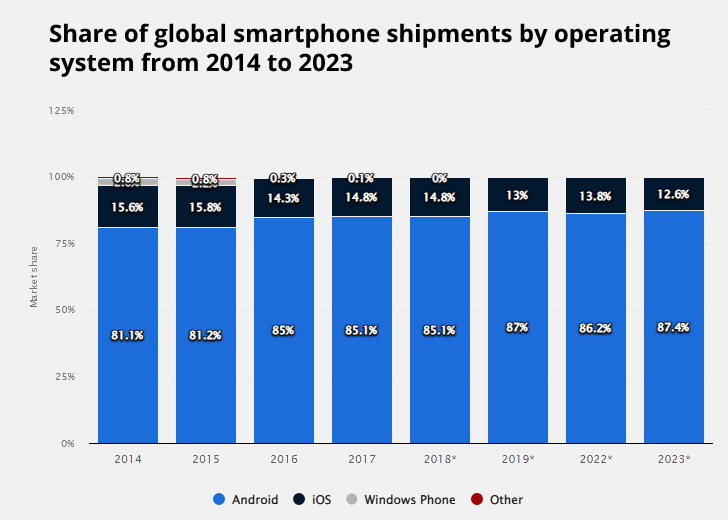
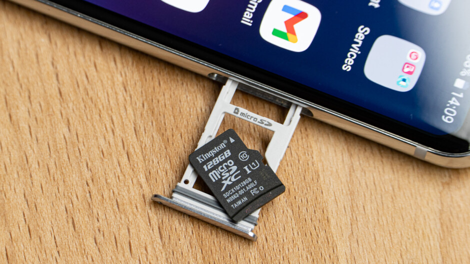

# parvesh_sandip-\_ios_vs_android

This is the comparison between IOS and Android

**why IOS is more better operating system than android**

**Ecosystem Integration**: The iPhone, iPad, Apple Watch, Mac, and even Apple TV all offer a tightly linked ecosystem with iOS. The user experience is made more uniform and fluid across all devices thanks to this seamless connection.

 
**App Consistency and Quality**: iOS is frequently commended for having a tighter-regulated app environment. Users can more easily identify well-designed and dependable programmes because to the Apple App Store's inclination to have tougher restrictions, which results in typically higher-quality apps and a consistent design language.

 
**Software Updates**: Apple is renowned for releasing security patches and significant iOS updates in a timely manner. This guarantees that users, even on older devices, have access to the newest features and security upgrades.

 
 **Privacy and security**: Apple places a high priority on protecting user privacy and the security of their data. A more secure environment for iOS users is made possible by features like app tracking transparency, end-to-end encryption in iMessage, and the Secure Enclave.

**Cutomer service**: Apple's customer service is frequently commended for its excellence. In-person help and repairs are available at the Apple Store, and AppleCare gives choices for an extended warranty and technical support.

 
**Optimisation of Hardware and Software**: Apple develops its own hardware and software, enabling tight integration and optimisation. Longer device lifespans and improved performance may arise from this.

**Smooth User Interface**: The user interface of iOS is renowned for being fluid and reliable. The smooth animations and simple movements make the experience more user-friendly.

\*\* This is the reason why IOS is way better than android

**Androids are far better than IOS - Sandip Thapa**

1.**Customization**: Android allows for a higher level of customization. Users can change home screen layouts, use widgets, and even install alternative launchers to personalize the user experience to a greater extent than IOS. Android, being an open-source platform, offers a high degree of customization, allowing users to tweak various aspects of their devices and applications.Some of them are: Home Screen and Widgets, Wallpaper, Themes and Launchers, Notification Settings, Quick Settings and Status Bar, Fonts and Text Sizes, System Themes, Accessibility etc.

2.**Variety of Hardware Options**: Android devices come in various shapes, sizes, and price points, giving consumers more choices in terms of hardware.This diversity is one of Android's strengths, as it allows for a broad range of devices with varying capabilities and form factors. This means you can find Android devices that fit your budget and specific requirements.Here are some of the key hardware options you can find in Android devices: Smartphones,Tablets,Wearable Devices,Smart TVs,Gaming Consoles, Smart Home Devices,Drones and Robots,Foldable and Dual-Screen Devices etc. 

3.**Open Ecosystem**: Android has a more open ecosystem, which can be an advantage for developers and power users who want more control over their devices. You can sideload apps from outside the official app stores and access the file system more freely.

4.**Google Services Integration**: Android is tightly integrated with Google services, which can be a significant advantage if you're heavily invested in the Google ecosystem (Gmail, Google Photos, Google Drive, etc.).

5.**Multitasking**: Android traditionally offers more robust multitasking capabilities, making it easier to switch between apps and perform various tasks simultaneously. Here are some key aspects of multitasking are :App Switching ,Background Processes,Split-Screen and Picture-in-Picture,Notifications,Task Lifecycle, Task Manager,Background Services,Background Restrictions etc.

6.**Affordability**: Android devices come in a wide range of price points, including budget-friendly options, which can be appealing for cost-conscious consumers. So, people can buy Androids in cheap price.

7.**Expandable Storage**: Many Android devices offer the option to expand storage via microSD cards, which can be essential for users who require a lot of storage space. This feature allows users to store more apps, photos, videos, and other data on their devices without having to rely solely on the internal storage.

**Thus Android is far better than IOS due to these varieties of features.Androids are all over IOS**

