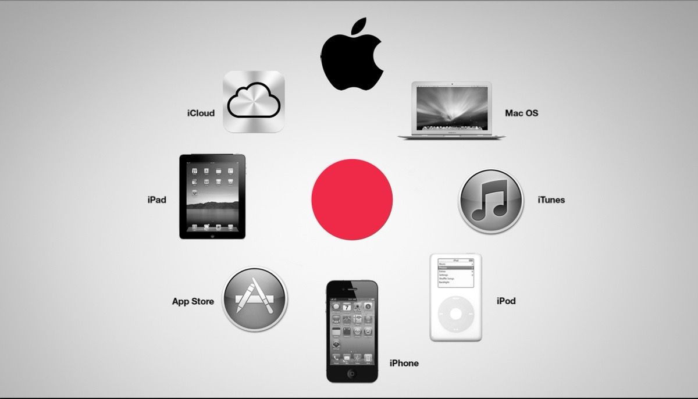
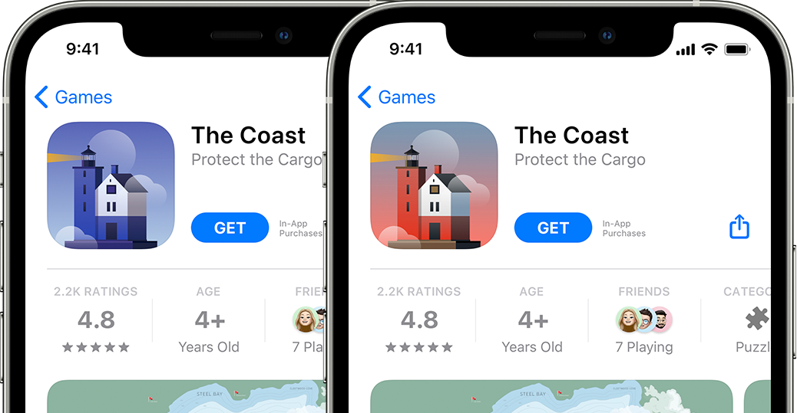
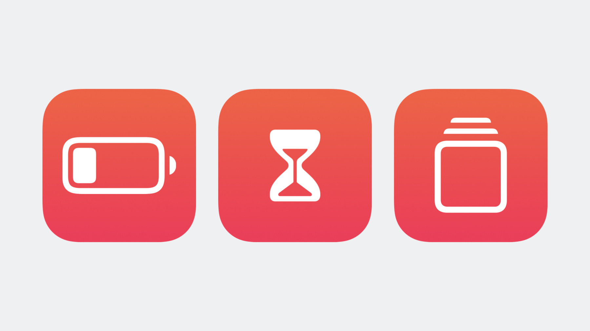

# parvesh_sandip-_ios_vs_android
This is the comparison between IOS and Android

**why IOS is more better operating system than android**

**Ecosystem Integration**: The iPhone, iPad, Apple Watch, Mac, and even Apple TV all offer a tightly linked ecosystem with iOS. The user experience is made more uniform and fluid across all devices thanks to this seamless connection.

 
**App Consistency and Quality**: iOS is frequently commended for having a tighter-regulated app environment. Users can more easily identify well-designed and dependable programmes because to the Apple App Store's inclination to have tougher restrictions, which results in typically higher-quality apps and a consistent design language.

 
**Software Updates**: Apple is renowned for releasing security patches and significant iOS updates in a timely manner. This guarantees that users, even on older devices, have access to the newest features and security upgrades.

 
 **Privacy and security**: Apple places a high priority on protecting user privacy and the security of their data. A more secure environment for iOS users is made possible by features like app tracking transparency, end-to-end encryption in iMessage, and the Secure Enclave.

**Cutomer service**: Apple's customer service is frequently commended for its excellence. In-person help and repairs are available at the Apple Store, and AppleCare gives choices for an extended warranty and technical support.  

 
**Optimisation of Hardware and Software**: Apple develops its own hardware and software, enabling tight integration and optimisation. Longer device lifespans and improved performance may arise from this.

 
**Smooth User Interface**: The user interface of iOS is renowned for being fluid and reliable. The smooth animations and simple movements make the experience more user-friendly.

**This is the reason why IOS is way better than android**
cdrfgtfdewsdtyhgfesdfgt4rftgr4rgyg